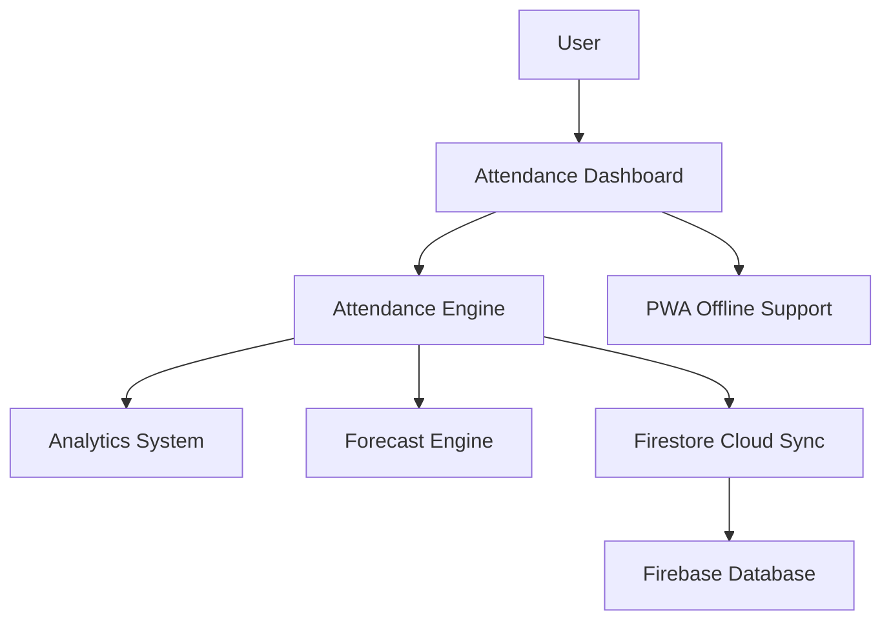
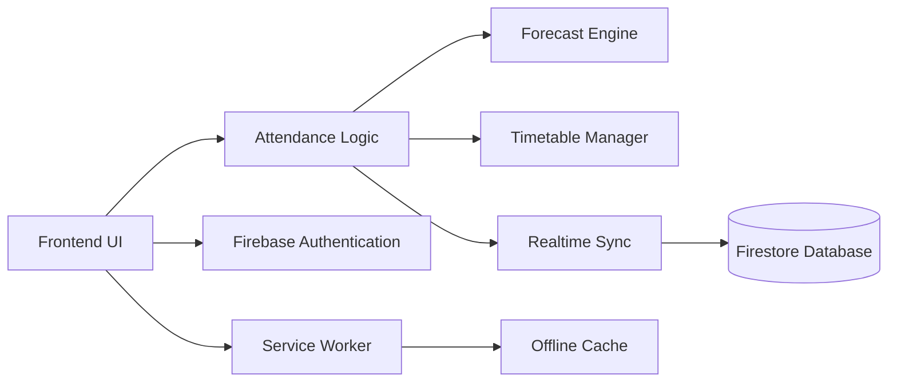
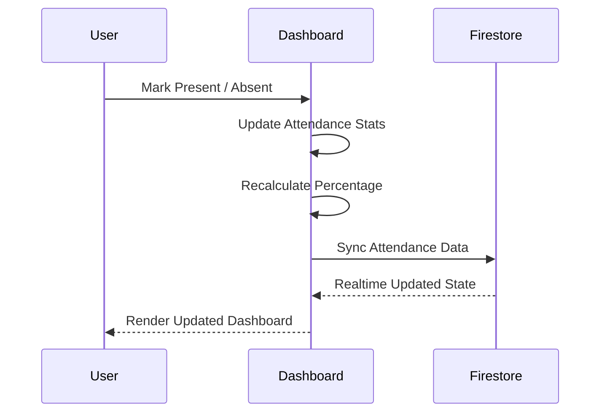
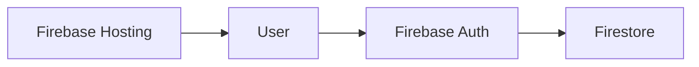
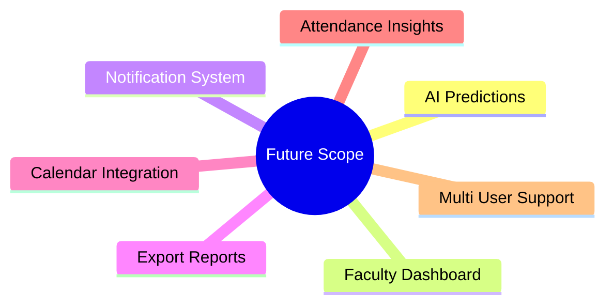

# 75Sync Pro

> Real time attendance intelligence system with cloud sync, predictive analytics, and Progressive Web App support.

75Sync Pro is a smart attendance management platform built for students to track attendance, analyze trends, forecast shortage risks, and maintain attendance safely above academic thresholds using real time cloud synchronization.

---

# Overview



---

# Features

- Real time attendance tracking
- Subject wise attendance analytics
- Attendance forecasting and safe leave prediction
- Firebase Authentication
- Firestore realtime cloud sync
- Dynamic timetable system
- Daily agenda management
- PWA install support
- Responsive glassmorphism UI
- Offline support through Service Workers
- Google account linking

---

# Tech Stack

| Category | Technologies |
|---|---|
| Frontend | HTML, CSS, JavaScript |
| Styling | TailwindCSS |
| Backend Services | Firebase |
| Database | Firestore |
| Authentication | Firebase Auth |
| Deployment | Firebase Hosting |
| PWA | Service Workers, Manifest |

---

# System Architecture



---

# Attendance Workflow



---

# Forecast Engine

The platform continuously analyzes attendance percentages and predicts:

- How many classes can still be missed safely
- Number of classes required to recover attendance
- Risk zones below 75%

## Forecast Formula

```math
Attendance % = (Present Classes / Total Classes) × 100
```

### Safe Leave Formula

```math
Safe Leaves = floor((P - 0.75 × T) / 0.75)
```

Where:
- `P` = Present Classes
- `T` = Total Classes

---

# Project Structure

```bash
75Sync-Pro/
│
├── index.html
├── firebase.json
├── manifest.json
├── sw.js
│
├── assets/
│
└── README.md
```

---

# Firebase Integration



---

# Progressive Web App Support

75Sync Pro supports:
- Installable application experience
- Offline caching
- Mobile optimized UI
- Standalone mode

---

# UI Highlights

- Responsive dashboard layout
- Dynamic attendance progress rings
- Interactive analytics cards
- Real time visual feedback
- Modern glassmorphism design system

---

# Installation

## Clone Repository

```bash
git clone https://github.com/yourusername/75Sync-Pro.git
cd 75Sync-Pro
```

---

# Firebase Setup

Enable:
- Firebase Authentication
- Firestore Database
- Firebase Hosting

Add configuration:

```js
const firebaseConfig = {
    // Firebase config
};
```

---

# Deployment

## Firebase Hosting

```bash
firebase init
firebase deploy
```

---

# Future Improvements



---

# Author

## Jatin Choudhary

CSE (Blockchain) · SATI Vidisha

- GitHub: https://github.com/JatinChoudhary-07
- LeetCode: https://leetcode.com/u/JatinChoudhary-07/
- LinkedIn: https://linkedin.com/in/jatin-choudhary-390336378

---
